# 🐔 Chicken Flock for Home Assistant

[](https://github.com/hacs/integration)
[](LICENSE)
[](https://www.home-assistant.io)

A Home Assistant integration for backyard flock management. Track egg production history, manage bird profiles with photos, and maintain a permanent record of your flock — all stored locally in JSON and surfaced through a polished Lovelace card.

Designed specifically for those looking to exit paid services like FlockStar or otherwise.  This is a backyard management application, NOT a commercial flock management hub.  If critical uptime or real business operations are involved, you are hereby recommended to stick with youir paid service.

!!!!!Warning!!!!!: Always back up your data.  This integration is desgined for this to be easy and streamlined- data can be downloaded in JSON or CSV format in milliseconds from any device directly from the card.  It is also stored in .storage for easy identification and regular automatic backup.  I am below a novice when it comes to software development, and used Claude heavily in the development of this integration.  Errors, issues, or unknown interactions could occur due to its use now or in the future.  By using this integration, you accept these risks as your own.

Despite this warning, we have extensively tested this integration with no issues so far and hope you enjoy!

---
If you find this integration useful long term, consider buying me a coffee — or a bag of chicken feed. 🐔

# Bitcoin (BTC)
```
bc1q6xg9c68ctasnuy4ulykutek00qfqdg7ked3wx0
```
---
## Monero (XMR)
```
84rnq45GLope8ZtugXternBAun7cMCXVL1JcTFsWp1qW7jCMaa8cYL9NCiSAiZJMsJe77pMSUJrHdeaZRsvP9jGs7LB2DvW
```
---
> Built with [Claude](https://claude.ai) by [ChavoDeLa](https://github.com/ChavoDeLa).
---

## Basic Usage
- Install the integration
- register the card in resources
- drop the card on a new dashboard
- add birds, import data as necessary
- add photos, notes, etc
- begin recording daily
- at midnight every night, counters reset to zero, counts are saved to JSON file
- historical data and stats are populated automatically from live entries and JSON data file

---

## Installation

### Integration Via HACS (recommended)

1. In HACS, go to **Integrations → ⋮ → Custom repositories**
2. Add `https://github.com/ChavoDeLa/ha-chicken-flock` as an **Integration**
3. Find **Chicken Flock** in the HACS integration list and install
4. Restart Home Assistant

### Lovelace card Via HACS (recommended)

1. In HACS, go to **Frontend → ⋮ → Custom repositories**
2. Add `https://github.com/ChavoDeLa/ha-chicken-flock-card` as **Dashboard**
3. Find **Chicken Flock Card** and install
4. Refresh your browser

### Integration Manual installation

1. Download the latest release
2. Copy `custom_components/chicken_flock/` to your `config/custom_components/` folder
3. Copy `www/chicken-flock-card.js` to `config/www/`
4. Restart Home Assistant

### Lovelace card Manual installation

Copy `chicken-flock-card.js` from https://github.com/ChavoDeLa/ha-chicken-flock-card to `config/www/`, then register it as a resource:

```yaml
lovelace:
  resources:
    - url: /local/chicken-flock-card.js?v=1
      type: module
```

---

## Configuration

1. Go to **Settings → Devices & Services → Add Integration**
2. Search for **Chicken Flock**
3. Click through the one-step setup

Manage your flock from the Lovelace card. No YAML configuration is needed.

---

### Adding the card to your dashboard

```yaml
type: custom:chicken-flock-card
```

### Recorder configuration (recommended)

Add to `configuration.yaml` to prevent large attribute payloads from causing recorder warnings:

```yaml
recorder:
  exclude:
    entities:
      - sensor.flock_egg_history
      - sensor.flock_roster
    entity_globs:
      - number.flock_*
```

No additional configuration options required. All settings are in the card's ⚙ Settings tab.

---
## Screenshots

### Active flock view
Bird cards with photos, breed, age, active/tracking badges, and live egg counters with +/− buttons. Sort A–Z or by age, hide roosters with one click.

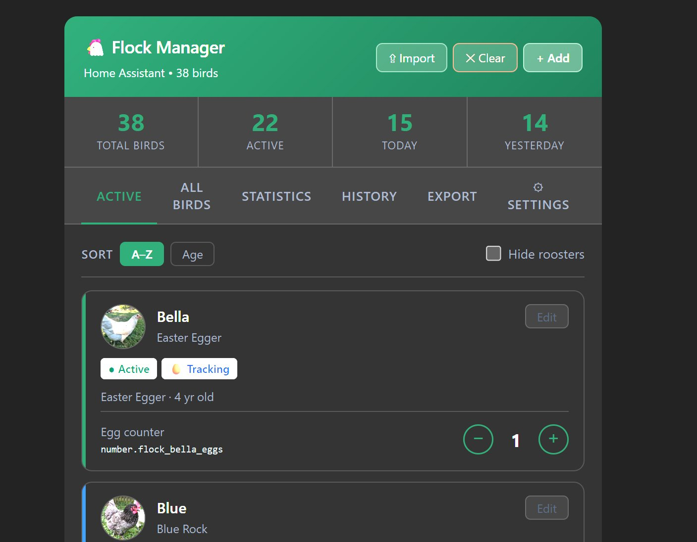

### All birds — including inactive and deceased
Full roster with photos, notes, and colour-coded left-edge accent bars. Deceased birds shown with dimmed styling.

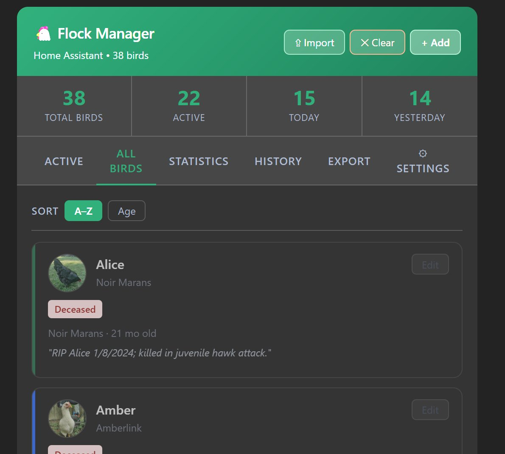

### Statistics — overall totals
KPI tiles for all-time, yearly, monthly, weekly, daily average, weekly average, best day, and days logged.

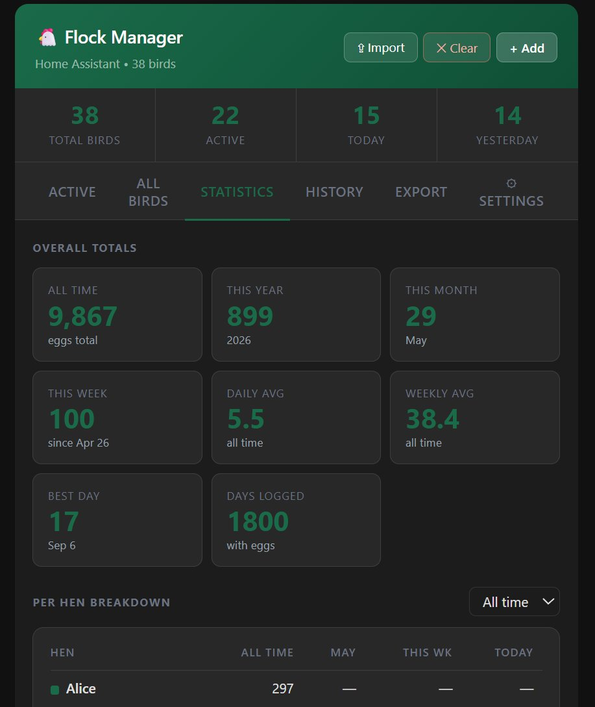

### Statistics — per-hen breakdown and leaderboard
Per-hen table with all-time, current month, this week, and today columns. Filterable by year. Top 5 leaderboard with selectable time period.

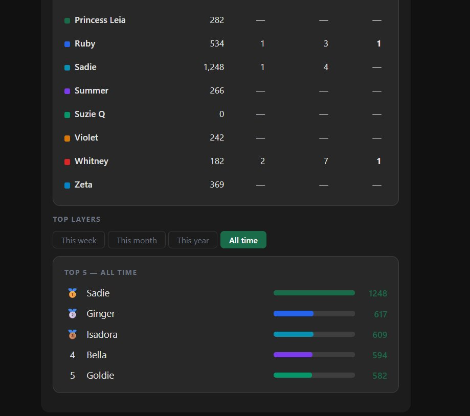

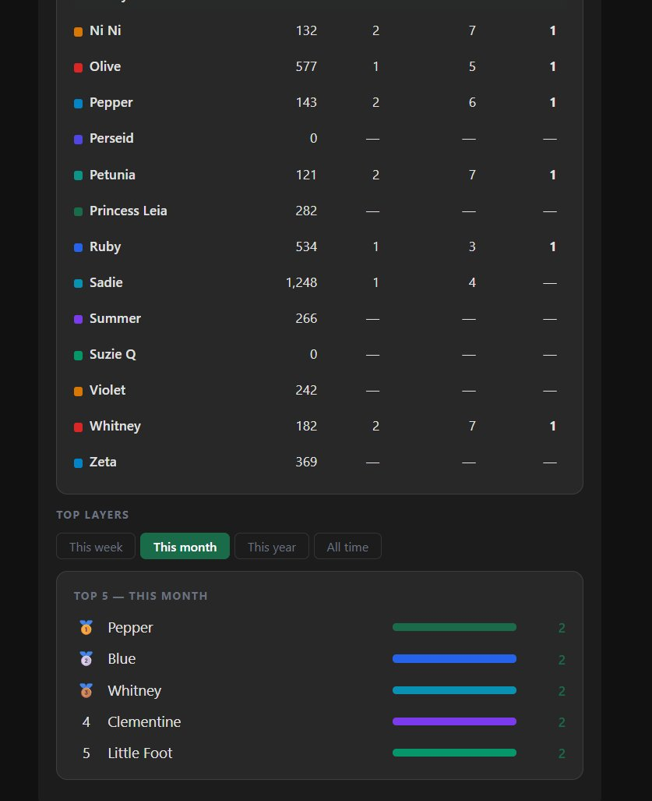

### History — stacked bar chart
Monthly view with stacked colour bars per hen, summary stats, and colour legend. Filter by year, month, week, or individual day. ✎ Edit button for correcting past records.

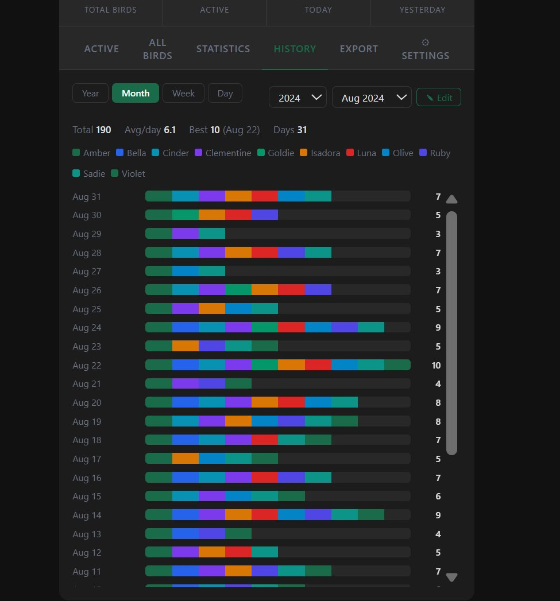

### Export & backup
CSV export, JSON export, full backup download, and restore from backup — all from the card UI.

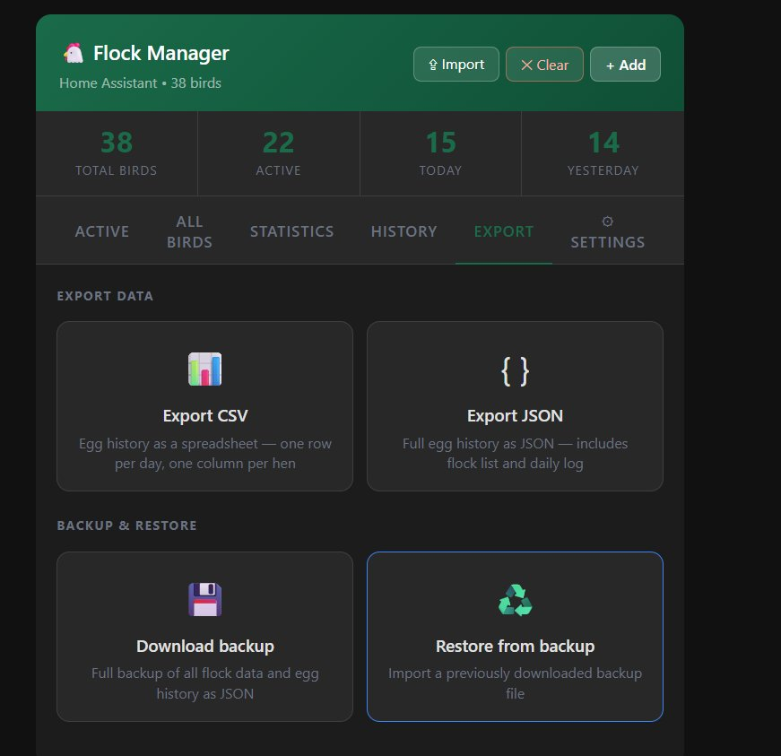

### Theme settings
Five colour presets (Forest Green, Ocean Blue, Deep Teal, Violet, Slate) plus fully custom colour pickers for all accent values. Changes apply live across the entire card.

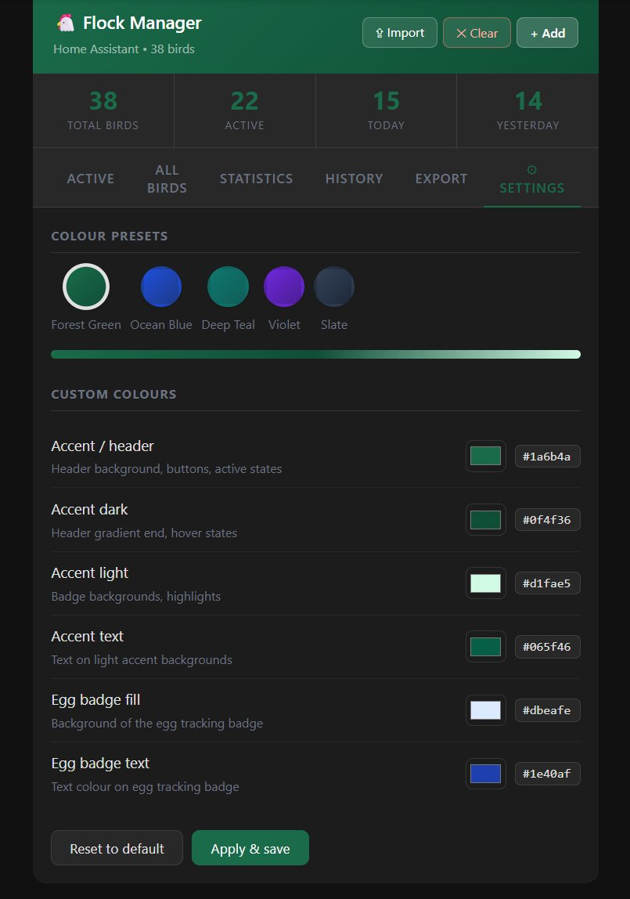

### HA integration page
Single click initial config.

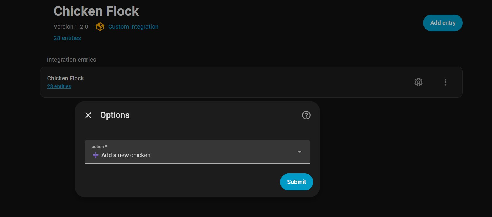

### Config flow — flock management
Add, edit, and remove birds from HA's native config flow as well as the Lovelace card (card is better)

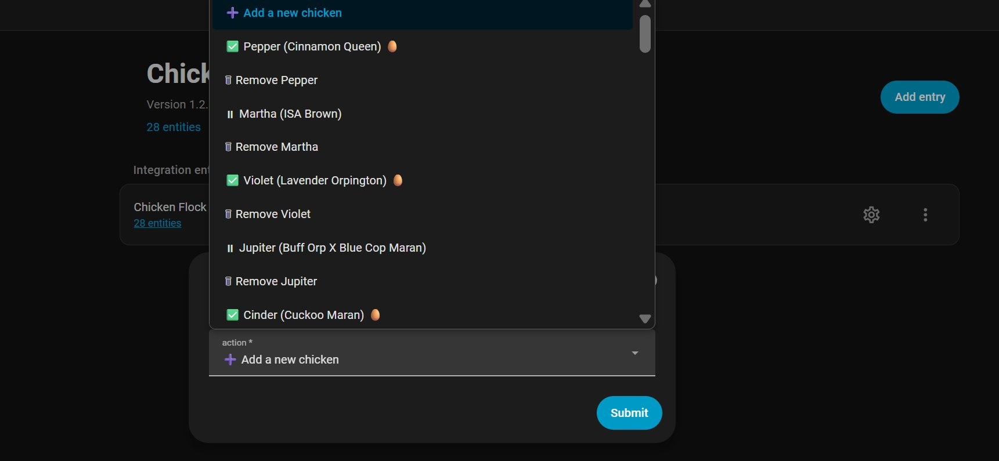

### JSON storage and export
Daily egg log stored in `.storage/chicken_flock_data` — and exportable as a clean JSON file with flock profiles and full history.

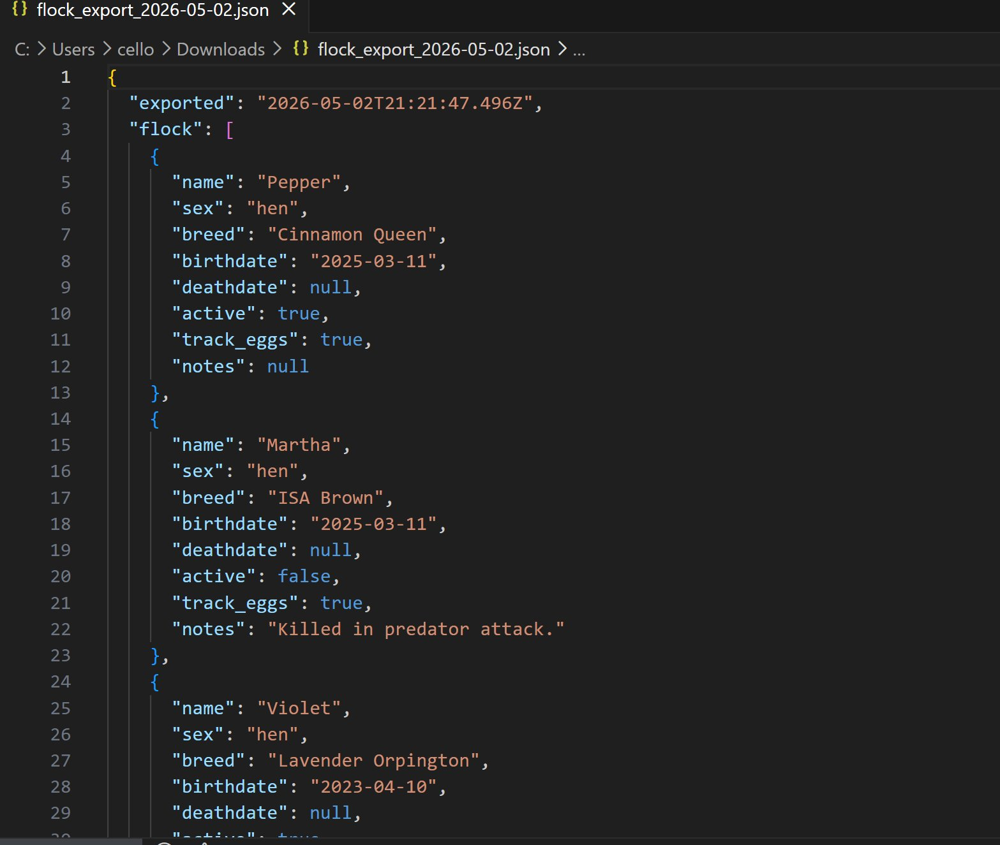

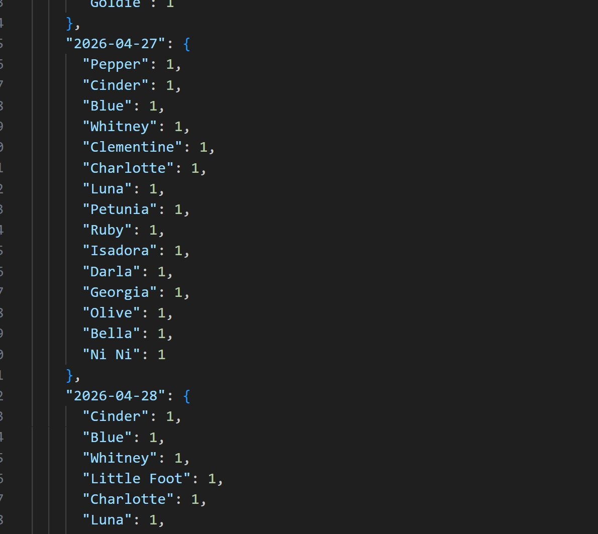

### CSV Export
Export CSV example

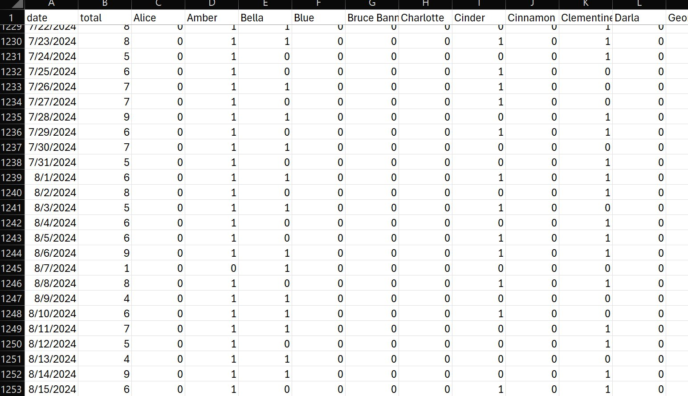

---

## Features

### Flock management
- Per-bird profiles: name, breed, sex, hatch date, death date, active/inactive status, notes
- Bird photo and egg reference photo per hen
- Sort by name or age; hide roosters from the active view
- Add, edit, and remove birds from the Lovelace card or HA's config flow

### Egg tracking
- Each active, tracked hen gets a `number.flock_<name>_eggs` entity
- Increment from any HA input: dashboard buttons, physical Zigbee/Z-Wave buttons, NFC tags, automations
- Automatic midnight reset — counts snapshot to permanent history and zero for the next day
- Manual reset via `chicken_flock.reset_daily_counts` service or the HA button entity

### History & statistics
- Permanent daily log stored in `.storage/chicken_flock_data` — never trimmed
- All-time, yearly, monthly, and weekly egg totals
- Per-hen leaderboards with selectable time periods
- Per-hen breakdown table with year picker
- Stacked bar chart history view filterable by year / month / week / day
- **History editing** — correct past records when you find eggs late

### Data management
- CSV import from FLOCKSTAR or any spreadsheet tracker (tab or comma delimited)
- Export egg history as CSV or JSON
- Full backup and restore from the card UI
- `chicken_flock.edit_history` service for programmatic history correction

---

## Entities created

| Entity | Type | Description |
|---|---|---|
| `number.flock_<name>_eggs` | Number | Per-hen egg counter (one per active tracked hen) |
| `sensor.flock_roster` | Sensor | Full flock list including inactive birds (card data source) |
| `sensor.flock_eggs_today` | Sensor | Live sum of all counters |
| `sensor.flock_eggs_yesterday` | Sensor | Yesterday's total from the log |
| `sensor.flock_egg_history` | Sensor | Full daily log as attributes (card history source) |
| `sensor.flock_active_hens` | Sensor | Count of living active hens |
| `sensor.flock_egg_trackers` | Sensor | Count of hens with egg tracking enabled |
| `sensor.flock_total_birds` | Sensor | Total birds ever added |
| `button.flock_reset_daily_counts` | Button | Trigger a manual daily reset |

---

## Services

| Service | Description |
|---|---|
| `chicken_flock.add_chicken` | Add a bird to the flock |
| `chicken_flock.update_chicken` | Update a bird's profile |
| `chicken_flock.remove_chicken` | Remove a bird |
| `chicken_flock.reset_daily_counts` | Snapshot and zero all counters |
| `chicken_flock.edit_history` | Adjust a hen's count on a specific past date |
| `chicken_flock.import_members` | Bulk import bird profiles |
| `chicken_flock.import_history` | Bulk import historical egg data |
| `chicken_flock.upload_photo` | Upload a bird photo |
| `chicken_flock.upload_egg_photo` | Upload an egg reference photo |
| `chicken_flock.delete_photo` | Remove a bird photo |
| `chicken_flock.delete_egg_photo` | Remove an egg photo |
| `chicken_flock.deduplicate_flock` | Remove duplicate bird entries |
| `chicken_flock.clear_all_data` | Wipe all data (use with caution) |

---

## Connecting a physical button

Any HA-connected button (Zigbee, Z-Wave, ESPHome, NFC) can increment a counter:

```yaml
automation:
  - alias: "Henrietta laid an egg"
    trigger:
      - platform: event
        event_type: zha_event
        event_data:
          device_ieee: "aa:bb:cc:dd:ee:ff:00:01"
          command: "toggle"
    action:
      - service: number.set_value
        target:
          entity_id: number.flock_henrietta_eggs
        data:
          value: "{{ (states('number.flock_henrietta_eggs') | int) + 1 }}"
```

---

## Importing from FLOCKSTAR

Use the **⇪ Import** button in the card. The importer accepts tab or comma-delimited files.

**Member CSV format:**
```
Flock     Name       Sex     Breed               Hatched     Active  Track Eggs  Notes
Chickens  Henrietta  Female  Rhode Island Red    3/11/2025   TRUE    TRUE
Chickens  Jupiter    Male    Buff Orp X Maran    8/8/2024    FALSE   FALSE
```

**History CSV format (one row per egg):**
```
Date        Member
3/7/2021    Henrietta
3/7/2021    Goldie
3/8/2021    Henrietta
```

---

## Data storage

All flock data is stored at:
```
config/.storage/chicken_flock_data
```

Photos are stored at:
```
config/www/flock_photos/<chicken_id>.jpg
config/www/flock_photos/<chicken_id>_egg.jpg
```

The `.storage` file is included in standard HA backups. Use the card's Export tab to download a portable JSON backup at any time.

---

## Troubleshooting

**Counter entities not appearing**
Ensure the bird is set to Active and Track Eggs. Only active, tracked hens without a death date get counter entities.

**History shows eggs on the wrong date...because a few were missed**
Use the **✎ Edit** button in the History tab to correct individual entries.

**Integration fails to load after update**
Delete the Python cache and restart:
```bash
rm -rf /config/custom_components/chicken_flock/__pycache__
```

**Card not updating after file change**
Bump the version query string (?v=xx) on the resource URL in the Resources tab under Dashbnoards:
```yaml
url: /local/chicken-flock-card.js?v=2
```

---

## Contributing

Issues and PRs welcome at [github.com/ChavoDeLa/ha-chicken-flock](https://github.com/ChavoDeLa/ha-chicken-flock).

---

## License

MIT License — see [LICENSE](LICENSE) for details.

---

## Credits

Built with [Claude](https://claude.ai) by [ChavoDeLa](https://github.com/ChavoDeLa).
